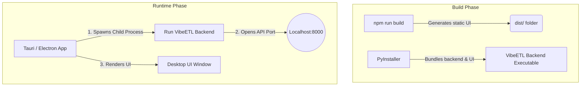

# Building Cross-Platform Executables for Web Apps

Packaging a full-stack application (like VibeETL, which has a React frontend and a Python backend) into a single, double-clickable executable (EXE) is a fascinating process. Unlike a simple C++ script that compiles directly into machine code, web apps require bundling multiple environments (Node.js, Python, a web server, and a browser engine) into one package.

Here is an educational breakdown of how the industry achieves this across Windows, macOS, and Linux.

---

## 1. The Core Challenge

When you run VibeETL right now, you are running two distinct processes:
1. **The Backend:** A Python server (`run.py`) running in a Python interpreter.
2. **The Frontend:** A Vite/React development server (`npm run dev`) rendering in your web browser.

To give a user an `.exe` file, you need to bundle the Python interpreter, your backend code, your frontend HTML/JS files, and potentially a web browser window into a single self-extracting payload.

> [!NOTE] 
> True "cross-platform" compilation usually requires you to run the build process *on the target operating system*. To build a macOS `.app`, you generally need to run the build script on a Mac. To build a Windows `.exe`, you build it on Windows. CI/CD pipelines (like GitHub Actions) are heavily used to automate this across all three OS types.

---

## 2. How the Backend is Packaged (Python to EXE)

Python is an interpreted language, not a compiled one. To turn Python into an executable, developers use **Freezers**.

### The Industry Standard: PyInstaller
[PyInstaller](https://pyinstaller.org/) reads your `run.py` script, analyzes every library you imported (like Polars, Playwright), and bundles them alongside a stripped-down Python interpreter into a single folder or a single `.exe` file.

When the user clicks the `.exe`:
1. It silently extracts the Python environment into a temporary folder.
2. It boots up the Python backend in the background.

**Cross-Platform Outputs:**
- **Windows:** `.exe`
- **macOS:** `.app` (usually distributed in a `.dmg` installer)
- **Linux:** Executable binary (often bundled into an `.AppImage`)

---

## 3. How the Frontend is Packaged (Desktop UI)

Once your backend is an executable, how does the user see the UI without opening Chrome and typing `localhost:5173`? 

### Approach A: The "Localhost" Wrapper (Simplest)
You build your React app for production (`npm run build`), which generates static HTML, CSS, and JS files. You configure your Python backend to serve these static files.
When the user clicks your `.exe`, it starts the server and automatically runs a command to open their default web browser to `http://localhost:8000`.

### Approach B: Electron (The Industry Heavyweight)
If you want your app to look like a real desktop app (like Discord, Slack, or VS Code) rather than a website in Chrome, you use **Electron**.
Electron embeds the Chromium browser engine and Node.js. 
- The Electron wrapper launches an invisible Chromium window.
- It spawns your Python `.exe` in the background as a child process.
- It displays your React UI inside the desktop window.
*Drawback:* Electron apps are notoriously heavy and use a lot of RAM.

### Approach C: Tauri (The Modern Alternative)
[Tauri](https://tauri.app/) is the modern successor to Electron. Instead of bundling a massive Chromium browser, it uses the OS's native webview (Edge WebView2 on Windows, WebKit on Mac). 
- It creates incredibly lightweight executables (often <10MB compared to Electron's 150MB).
- It handles the exact same child-process spawning for your Python backend.

---

## 4. How VibeETL Could Be Packaged

If we were to convert VibeETL into a desktop app, here is the exact architectural pipeline we would build:

### The Step-by-Step Workflow:
1. **Compile the Frontend:** Run `npm run build` in the `frontend` folder to turn React into static CSS/JS.
2. **Configure FastAPI/Python:** Tell the Python backend to serve the frontend's static `dist/` folder on the root URL (`/`).
3. **Freeze the Backend:** Use `pyinstaller --onefile run.py` to create `vibe_etl.exe`. 
4. **Wrap the UI:** Create a simple Tauri or Electron shell that launches `vibe_etl.exe` in the background and opens a desktop window pointing to the local server.
5. **Distribution:** Use a tool like `Inno Setup` (Windows) or `create-dmg` (Mac) to create an installer that users download.

> [!IMPORTANT]
> Because your scraper relies on **Playwright** (which downloads headless Chromium browsers), packaging it requires extra care. PyInstaller needs specific configurations to ensure Playwright's browser binaries are included in the final `.exe` payload, otherwise the web scraping will crash on the user's machine.
